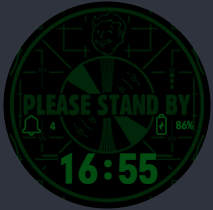
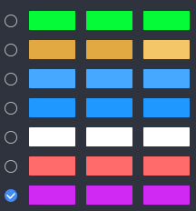

# PipBoy watchface for WearOS

> This thing is made just for fun after getting WearOS device on hand. About 2-3 hours spent in total. Initially shared in couple of places and changed due to requests at November 2022. Following seldom requests from different directions made sharing enhanced or fixed versions harder. So i just created this repo. There is WatchFaceStudio link. It is free and easy to use (which leads to limited functionality). Change it yourself. If you want me to change it, write me any place you can and i will add it. Eventually... May take months to notice and get to it. I am not even using this watch face myself, so it is very low priority.

 

Always on display is different.

Simple watch face for an Wear OS devices. Only for circular devices. Created using Samsung's [WatchFaceStudio](https://developer.samsung.com/watch-face-studio/download.html) (WFS), so it is not really sophisticated, and quite a number of things can only be added using some trick, if ever.

> No real sourcefile is attached, as WFS uses sigle savefile. Said savefile is, in fact, just an easily extractable archive. But i don't feel like extracting savefile, committing changes and uploading next version by 'Releases' every time I have to do something. This watchface was made for fun and only some requests after sharing this only made me change some aspects and describe it better.

## Behaviour

Everything is on the screen. Except...

1. Changing parts are:
* Three PipBoy animations (the ones i was able to find and seemed fitting - walking, wakingup/goingtosleep, resting);
* Extra animation for heartbeat > 140 - adrenaline/exhaustion.
* Low charge indicator for % < 35. Just text, though.
* Charging indicator.
2. Invisible shortcuts (complications) at certain places.
3. Some more colours (check in watchface settings).

## WFS tricks I used

Basically, opacity. Check the opacity modificator for elements. Want something gone or appear at certain time or trigger? As all of it comes by boolean(0-1) or changing some number. 
Multiply/divide/substract/add that number to the opacity and you will get that effect. One thing disappears and other appears on that place.
Yes, WFS is limited just like that. But it provides creation of energy efficient and any system compitable application.

Maybe one day i will try making it from scratch on Flutter. Just to see how well Flutter works on WearOS devices.

